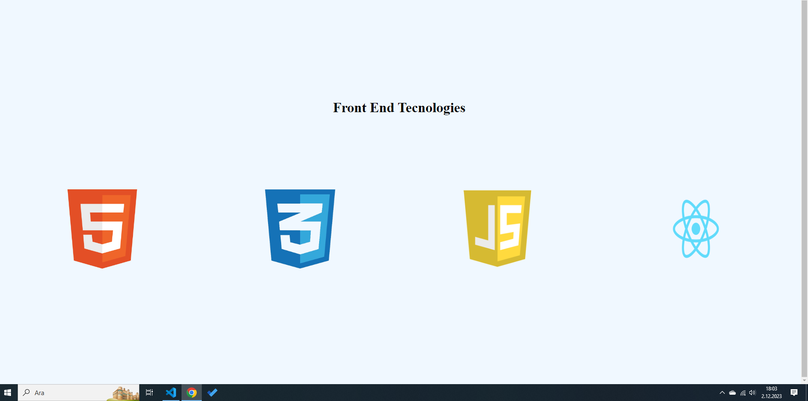
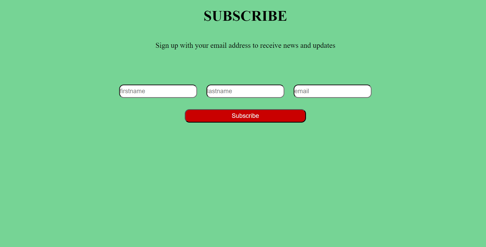
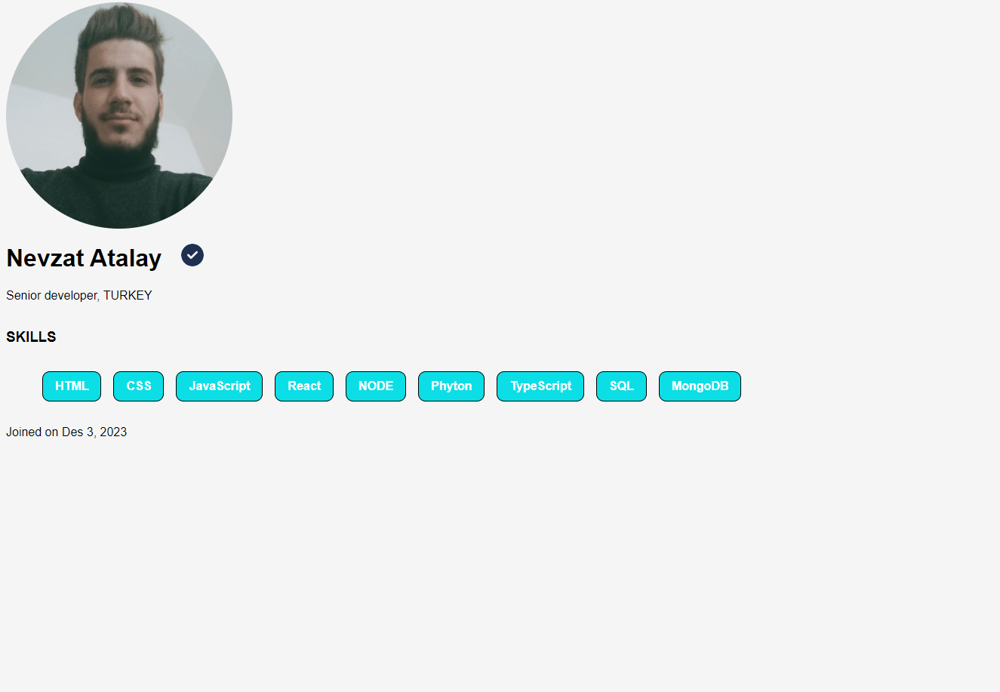

# Exercises Day 3 - Setting Up


## Exercise Answers

- ### [Exercise Level 1](#exercises-level-1)
- ### [Exercise Level 2](#exercises-level-2)
- ### [Exercise Level 3](#exercises-level-3)

### [Home](../README.md) | [<< Day 2](day_02.md) | [Day 4 >>](day_04.md) <hr>

 ### Exercises Level 1

1. What is a module?

```
Module is the name given to a part of a software that contains one or more routine operations. One or more modules can be developed independently of each other and used to create software.
```
2. What is package?

```
A Package is a module or a collection of modules. For instance, React, ReactDOM are packages.
```
3. What is the difference between a module and a package.

```
Packages are a much more comprehensive structure than modules. Because there is (usually) more than one module in a package.
```
4. What is NPM?

```
NPM (Node Package Manager) is a package manager for Node.js. Node.js is a platform for running JavaScript.
```
5. What is Webpack?

```
Webpack is a module packager used to unify JavaScript files used in web applications.
```
6. How do you create a new React project?

```
After installing create-react-app, you can start creating a new React project by running the “create-react-app my-app” command in your terminal.
```
7. What are the files and folders inside a project folder(package.json, package-lock.json or yarn.lock, .gitignore,node_modules and public)?

```
- package.json- List of packages the applications uses
- package-lock.json - a means to lock the version of the package
- gitignore - React boilerplate comes with git initiated, and the .gitingore allows files and folders not to be pushed to GitHub
- node_modules - stores all the necessary node packages of the React applications.
- public - It is a folder where files such as html, css, images and javascript are kept, which can be accessed through the application. Index.html, which is the main framework of the React application, is also kept in this folder.
```
8. What is your favorite code editor (I believe that it is Visual Studio Code)?
```
- Yes of course
```
9. Add different Visual Studio Code extensions to improve your productivity(eg. prettier, ESLint etc).

```
added
```
10. Try to make a different custom module in a different file and import it to index.js.

## Exercises Level 2


1. Import and render the following images
   
```js

  // style.css


   body{
    display: flex;
    align-items: center;
    justify-content: center;
    background-color: aliceblue;
    height: 100vh;
  }
  .front-end{
    display: flex;
    flex-direction: column;
    align-items: center;
  }
  .front-end div{
    display: flex;
    flex-direction: row;
    justify-content: space-around;
  }
  .front-end h3{
    margin-bottom: 100px;
  }
  .front-end img{
    width: 10%;
  }

  // index.js

import React from 'react'
import ReactDOM from 'react-dom'

// To get the root element from the HTML document

import html from './image/html_logo.png'
import css from './image/css_logo.png'

import js from './image/js_logo.png'
import react from './image/react_logo.png'


const frontend = (
    <div className='front-end'>
        <h3>Front End Tecnologies</h3>
       <div>
        
        
        
        
        </div>
    </div>
)

const rootElement = document.getElementById('root')
// we render the JSX element using the ReactDOM package
ReactDOM.render(frontend,rootElement)

```


2. Use h1, p, input and button HTML elements to create the following design using JSX

```js
<!-- index.html -->

<!DOCTYPE html>
<html lang="en">
  <head>
    <meta charset="utf-8" />
    <meta name="viewport" content="width=device-width, initial-scale=1" />
    <link
      href="https://fonts.googleapis.com/css?family=Montserrat:300,400,500|Roboto:300,400,500&display=swap"
      rel="stylesheet"
    />
    <link rel="stylesheet" hrefF="style.css">
    <meta
      name="description"
      content="Web site created using create-react-app"
    />
    <title>30 Days Of React App</title>

    <style>
  
      body{
        margin: 0;
        padding: 0;
        background-color: rgb(118, 212, 149);
      }
      .header{
        display: flex;
        flex-direction: column;
        align-items: center;
        justify-content: center;
      }
      .form{
        display: flex;
        justify-content: center;
        align-items: center;
        flex-direction:column;
        margin-top: 60px;
      }
      .form input{
        padding: 5px 0;
        margin: 0 10px;
        max-width: 33%;
        border-radius: 10px;
      }
      .btn{
        padding: 5px 100px;
        margin-top: 25px;
        background-color:  rgb(201, 0, 0);
        border-radius: 10px;
        color: aliceblue;
      }
    </style>
   
  </head>
  
  <body>
    <div id="root"></div>
  </body>
</html>

// index.js

// index.js
import React from 'react'
import ReactDOM from 'react-dom'

const header = (
    <div className='header'> 
         <h1>SUBSCRIBE</h1>
        <p>Sign up with your email address to receive news and updates</p>
    </div>
)

const form = (
    <div className='form'>  
          <div>
          <input type='text' placeholder='firstname'></input>
           <input type='text' placeholder='lastname'></input>
           <input type='email' placeholder='email'></input>
          </div>
          <button className='btn'>Subscribe</button>
    </div>
)

const app = (
  <div className='app'>
    {header}
    {form}
  </div>
)


const rootElement = document.getElementById('root')
// we render the JSX element using the ReactDOM package
ReactDOM.render(app,rootElement)

```




## Exercises Level 3

1. Design the following user card.

```js
//style.css

*{
    font-family: sans-serif;
}
body{
    background-color:whitesmoke;
  }

/* header css  */

 
  .header .img-wrapper{
    width:300px;
    height: 300px;    
  }
  .header .tic{
    position: absolute;
    top: 328px;
    left: 240px;
    border-radius: 50%;
    width: 30px;
    }
  .header .img-wrapper img{
    width:100%;
    height: 100%;
    object-fit: cover;
    border-radius: 50%;
    object-position: 50% 38%;
  }

/* main css  */

.main{
    display: flex;
    flex-direction: column;
}
.main ul{
    display: flex;
    flex-direction: row;
    flex-wrap: wrap;
    list-style: none;
}
.main ul li{
    padding: 10px 16px;
    border: 1px solid black;
    margin: 0 8px;
    border-radius: 10px;
    background-color:rgb(12, 222, 230);
    color: #fff;
    font-weight: 600;
}

//index.js

import React from 'react'
import ReactDOM from 'react-dom'

import './style.css'
import image from './image/nevzat.jpg'

import tic from './image/circle-check-solid.svg'

const header = (
    <header className='header'>
      <div className='img-wrapper'>
      
      </div>
      <h1>Nevzat Atalay</h1>
      </img>
      <p>Senior developer, TURKEY</p>
    </header>
)

const main = (
  <header className='main'>
      <h3>SKILLS</h3>
      <ul>
      <li>HTML</li>
      <li>CSS</li>
      <li>JavaScript</li>
      <li>React</li>
      <li>NODE</li>
      <li>Phyton</li>
      <li>TypeScript</li>
      <li>SQL</li>
      <li>MongoDB</li>
    </ul>
  </header>
)

const footer = (
  <header className='footer'>
    <p>Joined on Des 3, 2023</p>
  </header>
)

const app = ( 
<div className='app'>
  {header}
  {main}
  {footer}
</div>
)

const rootElement = document.getElementById('root')
// we render the JSX element using the ReactDOM package
ReactDOM.render(app,rootElement)
```


### [Home](../README.md) | [<< Day 2](day_02.md) | [Day 4 >>](day_04.md) <hr>
 