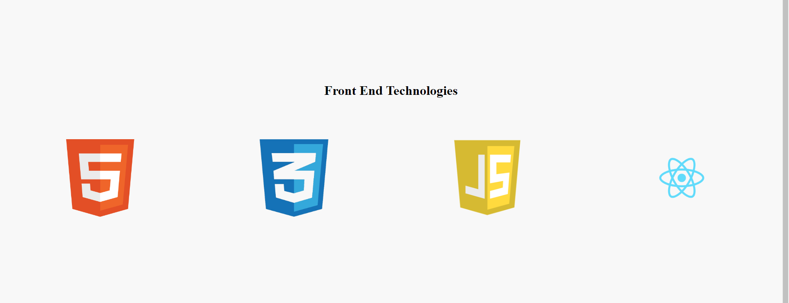
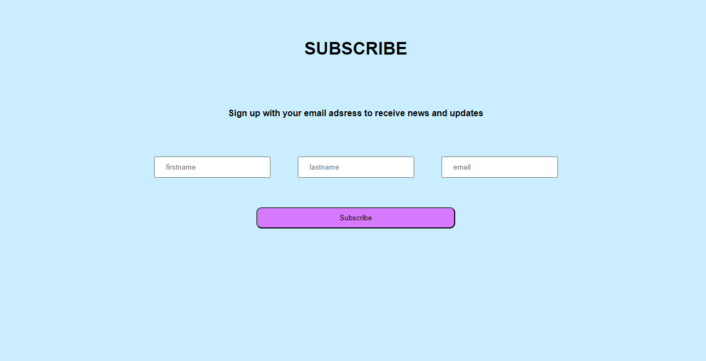
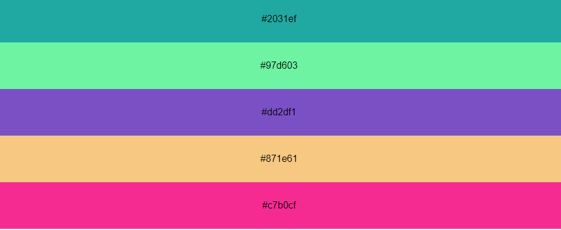
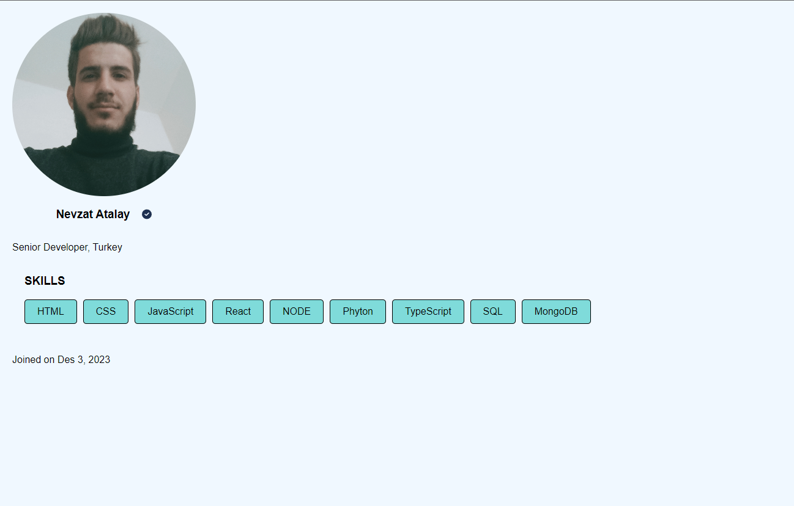

[< <  Day 3](day_03.md) | [Day 5 >>>](day_05.md) <br>

# Exercises Day 4

## Exercises: Level 1

1. What is the difference between a regular function and an arrow function?

```
The syntax of the arrow function is simple. It allows us to write clean code and the Arrow function does not allow access to the argument object.
```
2. What is a React Component?

```
React Components are building blocks that shape the user interface, have specific tasks, are defined as classes or functions, return react elements, and optionally take parameters.
```

3. How do you make a React functional component?

```
// React Function component syntax
// it can be arrow function, function declaration or function expression

const jsx = <tag> Content </tag>
const ComponentName = () => {
  return jsx
}
```

4. What is the difference between a pure JavaScript function and a functional component?
```
Functional components, unlike class components, do not have features such as state management or lifecycle methods. Instead, functional components return an output using the properties taken as input.
```
5. How small is a React component?

```
// This is a small components

const Button = () => <button> action </button>

```
6. Can we make a button or input field component?

```
// certainly

```
7. Make a reusable Button component.

```
// Button components
const Button = () => <button> action </button>
```
8. Make a reusable InputField component.

```
// Input components
const Imput = () => <input> action </input>
```
9. Make a reusable alert box component with one div parent element and one p child element of the div(warning alert box, success alert box).

```
// style.css
body{
  background-color: rgb(71, 71, 69);
}
.alert-box{
  border: 1px solid black;
  text-align: center;
  width: 50%;
  margin-left: 25%;
}
.alert-box p{
  color: aliceblue;
  font-weight: 600;

  // index.js
import React from 'react'
import ReactDOM from 'react-dom'

import './style.css'

const successMessage = "This is a success message"
const warningMessage = "This is a warning message"


const Warning = ()=> (
    <div className='alert-box'>
        <p>{warningMessage}</p>
    </div>
) 

const Succes = ()=> (
    <div className='alert-box'>
        <p>{successMessage}</p>
    </div>
) 

const app = (
    <>
        <Succes/>
        <Warning/>
   </>
)
const rootElement = document.getElementById('root')
// we render the JSX element using the ReactDOM package
ReactDOM.render(app,rootElement)
}
```

## Exercises: Level 2

1. Create functional components and display the following images

```
// sttyle.css

body{
  display: flex;
  flex-direction: column;
  justify-content: center;
  background-color: rgb(248, 248, 248);
  color: #fff;
  height: 100vh;
}
.main{
  display: flex;
  flex-direction: column;
  align-items: center;

}
.main h1{
  margin-bottom: 100px;
  color: black;
}
.main .img-container{
  display: flex;
  align-items: center;
  justify-content:space-around;
}
.main .img-container .img-wrapper {
  width: 10%;
}
.main .img-container .img-wrapper img{
  width: 100%;
}

// index.js

import React from 'react'
import ReactDOM from 'react-dom'

import html from  './image/html_logo.png'
import css from  './image/css_logo.png'
import js from  './image/js_logo.png'
import react from  './image/react_logo.png'
import './style.css'

const Main = () => (
<div className='main'>
    <h1>Front End Technologies</h1>

   <div className='img-container'>
      <div className='img-wrapper'>
         
      </div>
      <div className='img-wrapper'>
         
      </div>
      <div className='img-wrapper'>
         
      </div>
      <div className='img-wrapper'>
         
     </div>
    </div>
 </div>
)

const rootElement = document.getElementById('root')
// we render the JSX element using the ReactDOM package
ReactDOM.render(<Main />,rootElement)
```


2. Use functional component to create the following design

```
// style.css 

*{
  font-family: sans-serif;
}
body{
  background-color: #CAEDFF;
}
.main{
  display: flex;
  flex-direction: column;
  align-items: center;
  justify-content: space-evenly;
  height: 50vh;
}
.main p{
   font-weight: bold;
}
.main .input-wrapper{
  display: flex;
  gap: 50px;
}

.main .input-wrapper input{
  padding: 10px 20px;
}
.main .btn{
  padding: 10px 150px;
 background-color: #D67BFF;
 border-radius: 10px;
}

// index.js

import React from 'react'
import ReactDOM from 'react-dom'
import './style.css'

const Main = () =>(
   <div className='main'>
      <h1>SUBSCRIBE</h1>
      <p>Sign up with your email adsress to receive news and updates</p>
      <div className='input-wrapper'>
         <input type='text' placeholder='firstname'></input>
         <input type='text' placeholder='lastname'></input>
         <input type='email' placeholder='email'></input>
      </div>
      <button type='button' className='btn'>Subscribe</button>
   </div>
)

const rootElement = document.getElementById('root')
// we render the JSX element using the ReactDOM package
ReactDOM.render(<Main />,rootElement)
```



## Exercises: Level 3

1.  Use the given hexadecimal color generator in the example to create these random colors

```
// style.css

*{
  font-family: sans-serif;
}
body{
  margin: 0;
}

li{
  list-style: none;
  padding: 30px 0;
  border: 5px;
  text-align: center;
}

// index.js
import React from 'react'
import ReactDOM from 'react-dom'
import './style.css'


const hexaColor = () => {
   let str = '0123456789abcdef'
   let color = ''
   for (let i = 0; i < 6; i++) {
     let index = Math.floor(Math.random() * str.length)
     color += str[index]
   }
   return '#' + color
 }

const li1 = hexaColor()
const li2 = hexaColor()
const li3 = hexaColor()
const li4 = hexaColor()
const li5 = hexaColor()

 const app = (
   
   <div>
      <li style={{background:li1}}>{li1}</li>
      <li style={{background:li2}}>{li2}</li>
      <li style={{background:li3}}>{li3}</li>
      <li style={{background:li4}}>{li4}</li>
      <li style={{background:li5}}>{li5}</li>
   </div>

 )

const rootElement = document.getElementById('root')
// we render the JSX element using the ReactDOM package
ReactDOM.render(app ,rootElement)
```



2. Use functional component to design the following user card.

```
// style.css

*{
  font-family: sans-serif;
}
body{
  margin: 0;
  background-color: aliceblue;
}
.header{
  display: flex;
  flex-direction: column;
  align-items: normal;
  padding: 20px 0  0 20px  ;
}
.header .img-wrapper{
width:300px ;
height:300px ;
}

.header .img-wrapper img{
  width: 100%;
  height: 100%;
  object-fit: cover;
  object-position: 50% 38%;
  border-radius: 50%;
}

.header .substr{
  display: flex;
  flex-direction: row;
  width:300px ;
  justify-content: center

}
.header .substr .tic {
  padding: 0 0 0 20px  ;
}

/* main css */

.main h3{
  padding: 0 0 0 40px;
}
.main ul{
  display: flex;
  flex-wrap: wrap;
  list-style: none;
  gap: 10px;
}
.main ul li{
  border: 1px solid;
  padding: 10px 20px;
  border-radius: 5px;
  background-color: #7FDBDA;
}

/* footer css*/

.footer{
  margin-top: 50px;
  padding: 0 0 0 20px;
}

// index.js

import React from 'react'
import ReactDOM from 'react-dom'
import './style.css'

import nevzat from './image/nevzat.jpg'
import tic from './image/circle-check-solid.svg'


const Header = () => (
  <div className='header'> 
    <div className='img-wrapper'>
      
    </div>
    <div className='substr'>
      <h3>Nevzat Atalay</h3>
      
    </div>
    <p>Senior Developer, Turkey</p>
  </div>
)
const Main = () => (
  <header className='main'>
      <h3>SKILLS</h3>
      <ul>
      <li>HTML</li>
      <li>CSS</li>
      <li>JavaScript</li>
      <li>React</li>
      <li>NODE</li>
      <li>Phyton</li>
      <li>TypeScript</li>
      <li>SQL</li>
      <li>MongoDB</li>
    </ul>
  </header>
)

const Footer = () =>  (
  <header className='footer'>
    <p>Joined on Des 3, 2023</p>
  </header>
)


const app = (
<>
    <Header/>
    <Main/>
    <Footer/>
</>

)

const rootElement = document.getElementById('root')
// we render the JSX element using the ReactDOM package
ReactDOM.render(app ,rootElement)
```


[< <  Day 3](day_03.md) | [Day 5 >>>](day_05.md) <br>

[< <  Home > >](../README.md) 