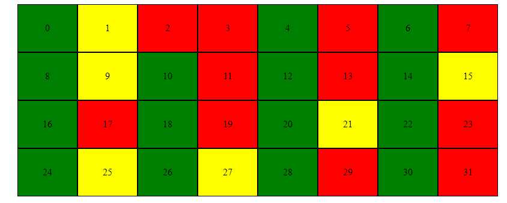
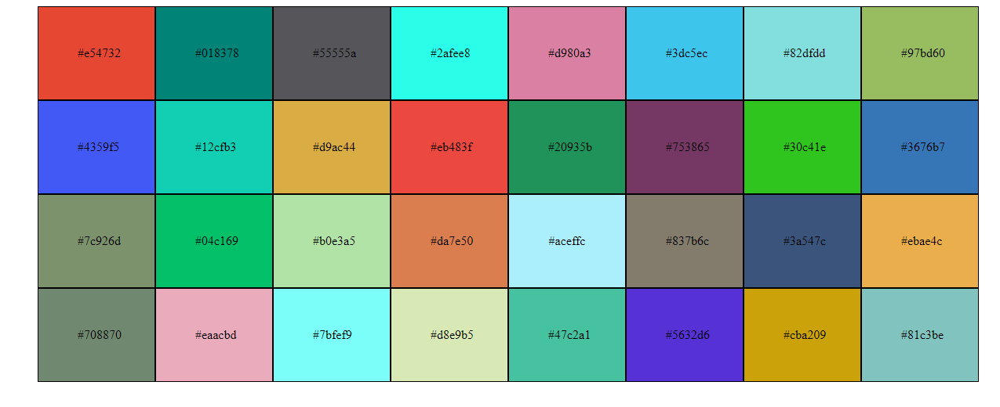

# Exercises Day 6 -Mapping Arrays


## Exercise Answers

- ### [Exercises:Level 1](#exercises-level-1)
- ### [Exercises Level 2](#exercises-level-2)
- ### [Exercises:Level 3](#exercises-level-3)

### [Home](../README.md) | [<< Day 5](day_05.md) | [Day 7 >>](day_07.md) <hr>

### Exercises Level 1

1. Why you need to map an array ?

```
In order to access the elements in the array and perform operations on them, we need to map the array
```

2. Why we need keys during mapping an array ?
```
 Keys should be given to the elements inside the array to give the elements a stable identity.
 ```
3. What is the importance of destructuring your code ?
```
To increase code readability and write less code
```
4. Does destructuring make your code clean and easy to read ?

```
Definitely
```
### [Exercises Level 2](#exercises-level-2)

1. In the following design, evens are green, odds are yellow and prime numbers are red. Build the following colors using React component
Number Generator

```js

// style.css

ul{
    display: grid;
    grid-template-columns:100px 100px 100px 100px 100px 100px 100px 100px ;
}
li{
    list-style: none;
    border: 1px solid;
    text-align: center;
    padding: 30px;
}


//index.js

import React from 'react'
import { createRoot } from 'react-dom/client';

import './style.css'


  //is prime function

  function isPrime(n) {
    // 0 ve 1 asal sayı değildir
    if (n === 0 || n === 1) {
      return false;
    }
    // 2 asal sayının tek çiftidir
    if (n === 2) {
      return true;
    }
    // Çift sayılar asal sayı olamaz
    if (n % 2 === 0) {
      return false;
    }
    // 3'ten n'in kareköküne kadar olan tek sayılara bölünebilir mi diye bakın
    let sqrt = Math.sqrt(n);
    for (let i = 3; i <= sqrt; i += 2) {
      if (n % i === 0) {
        return false;
      }
    }
    // Hiçbir sayıya bölünemiyorsa, asal sayıdır
    return true;
  }

  // select color function
  function color(number){

    // prime is red
    if(isPrime(number)){
      return "red"
    }
    // even is green
    else if(number%2===0){
      return "green"
    }
    //odd is yellow
    else if(!number%2===0){
      return "yellow"
    }
}


// HexaColor component
const HexaColor = () => {
 
// start loop 0 to 31
const arr =[];

for(let i=0; i<=31; i++){
  arr.push(i)
}
// map in array
const newArr = arr.map((num) => <li style={{background:color(num)}}>{num}</li>)
return <ul>{newArr}</ul>

}


const domNode = document.getElementById('root');
const root = createRoot(domNode);
root.render(<HexaColor />)

```


2. Create the following hexadecimal colors using React component
Number Generator

```js
//style.css

ul{
    display: grid;
    grid-template-columns:150px 150px 150px 150px 150px 150px 150px 150px ;
}
li{
    list-style: none;
    border: 1px solid;
    text-align: center;
    padding: 50px;
}

//index.js

import React from 'react'
import { createRoot } from 'react-dom/client';

import './style.css'


const HexaColor = () => {
 
const hexaColor = ()=> {
  let str = '0123456789abcdef'
  let color = ''
  for (let i = 0; i < 6; i++) {
    let index = Math.floor(Math.random() * str.length)
    color += str[index]
  }
  return '#' + color
}

const arr =[];

for(let i=0; i<=31; i++){
  arr.push(hexaColor())
}

const newArr = arr.map((ran) => <li style={{backgroundColor:ran}}>{ran}</li> )

return <ul>{newArr}</ul>


}
const domNode = document.getElementById('root');
const root = createRoot(domNode);
root.render(<HexaColor />)
```



### [Exercises Level 3](#exercises-level-3)

1. Make the following bar group using the given data

### [Home](../README.md) | [<< Day 5](day_05.md) | [Day 7 >>](day_07.md) 
