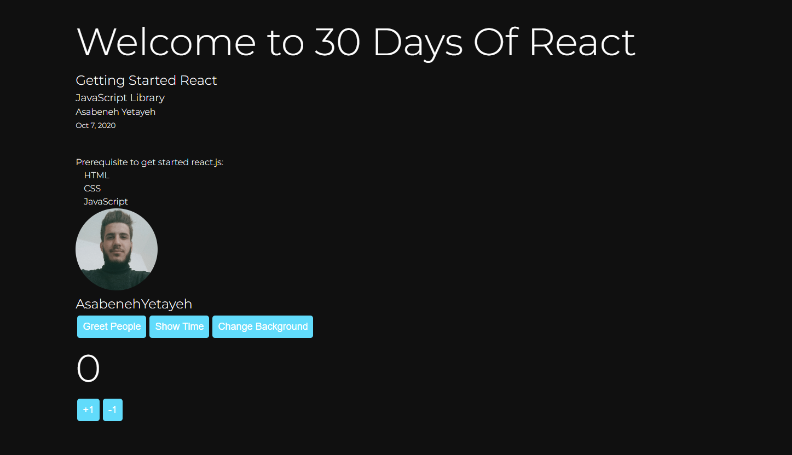

# Day 8 - States

## Exercises Answers

- ### [Exercises:Level 1](#exercises-level-1)
- ### [Exercises:Level 2](#exercises-level-2)
- ### [Exercises:Level 3](#exercises-level-3)

### [Home](../README.md) | [<< Day 6](day_06.md) | [Day 8 >>](day_08.md) <hr>

### Exercises Level 1

1. What was your state today? Are you happy? I hope so. If you manage to make it this far you should be happy.
```
Thank you, I'm fine, I've come this far and will finish this exercise.
```
2. What is state in React ?
```
Durum, bileşen hakkında veri veya bilgi içermek için kullanılan yerleşik bir React nesnesidir. Bir bileşenin durumu zamanla değişebilir; her değiştiğinde bileşen yeniden oluşturulur.
```
3. What is the difference between props and state in React ?
```
Props, verileri bir ana bileşenden alt bileşene aktarmak için kullanılırken durum, bir bileşen içindeki verileri yönetmek için kullanılır. Prop'lar değişmezdir ve bir bileşen içinde değiştirilemezken, durum değiştirilebilir ve setState işlevi kullanılarak güncellenebilir.22 Şub 2023
```
4. How do you access state in a React component ?
```
Reaksiyondaki herhangi bir yerden duruma erişmek için react-redux veya context gibi global durum yöneticilerini kullanın. Eğer proje küçükse, props kullanmanız veya belki de tüm bileşenlerin dışındaki global değişkenleri kullanmayı denemeniz gerekir. Davranışı denemek için tüm bileşenleri tek bir dosyaya koyabilir ve ardından uygun gördüğünüz şekilde modüler hale getirebilirsiniz.
```
5. How do you set a set in a React component ?
```
Bu, setState() yöntemi kullanılarak yapılır. setState() yöntemi, bileşen durumunda yapılan tüm güncellemeleri sıraya koyar ve React'a bileşeni ve onun alt öğelerini güncellenmiş durumla yeniden oluşturması talimatını verir.
```
### Exercises Level 2

1. Use React state to change the background of the page. You can use this technique to apply a dark mode for your portfolio.

```js
// style.css
* {
    box-sizing: border-box;
    padding: 0;
    margin: 0;
    color:#fff
  }

  html,
  body {
    height: 100%;
    line-height: 1.5;
    font-family: 'Montserrat';
    font-weight: 300;
    color: black;
  }

  .root {
    min-height: 100%;
    position: relative;
  }

  .header-wrapper,
  .main-wrapper,
  .footer-wrapper {
    width: 85%;
    margin: auto;
  }

  .header-wrapper,
  .main-wrapper {
    padding: 10px;
    margin: 2px auto;
  }

  h1 {
    font-size: 70px;
    font-weight: 300;
  }

  h2,
  h3 {
    font-weight: 300;
  }

  header {
    /* background-color: #61dbfb; */
    padding: 10px;
    background: #6cf;

  }

  main {
    padding: 10px;
    padding-bottom: 60px;
    /* Height of the footer */
  }

  ul {
    margin-left: 15px;
  }

  ul li {
    list-style: none;
  }

  footer {
    position: absolute;
    bottom: 0;
    width: 100%;
    height: 60px;
    /* Height of the footer */
     background: #6cf; 
  }

  .footer-wrapper {
    width: 200px;
    height: 200px;
    font-weight: 400;
    text-align: center;
    line-height: 60px;
  }
  img{
    width: 150px;
    height: 150px;
    object-fit: cover;
    border-radius: 50%;
    object-position: 50% 37%;
  }
  img{
    width: 150px;
  }

  .Footer{
    background-color: #6cf;
  }
  
  // index.js


import React from "react";
import { createRoot } from 'react-dom/client';
import nevzat from "./image/nevzat.jpg"
import './style.css'
 
// User Card Component
const UserCard = ({ user: { firstName, lastName, image } }) => (
  <div className='user-card'>
    
    <h2>
      {firstName}
      {lastName}
    </h2>
  </div>
)

// A button component
const Button = ({ text, onClick, style }) => (
  <button style={style} onClick={onClick}>
    {text}
  </button>
)

// CSS styles in JavaScript Object
const buttonStyles = {
  backgroundColor: '#61dbfb',
  padding: 10,
  border: 'none',
  borderRadius: 5,
  margin: 3,
  cursor: 'pointer',
  fontSize: 18,
  color: 'white',
}

// class based component
class Header extends React.Component {
  constructor(props) {
    super(props)
    // the code inside the constructor run before any other code
    this.state=props.state
  }
  render() {
    console.log(this.props.data)
    const {
      welcome,
      title,
      subtitle,
      author: { firstName, lastName },
      date,
    } = this.props.data

    return (
      <header  style={{backgroundColor:this.props.state.backgroundColor,color:this.props.state.backgroundColor}}>
        <div className='header-wrapper'>
          <h1>{welcome}</h1>
          <h2>{title}</h2>
          <h3>{subtitle}</h3>
          <p>
            {firstName} {lastName}
          </p>
          <small>{date}</small>
        </div>
      </header>
    )
  }
}

const Count = ({ count, addOne, minusOne }) => (
  <div>
    <h1>{count} </h1>
    <div>
      <Button text='+1' onClick={addOne} style={buttonStyles} />
      <Button text='-1' onClick={minusOne} style={buttonStyles} />
    </div>
  </div>
)

// TechList Component
// class base component
class TechList extends React.Component {
  constructor(props) {
    super(props)
    this.state=props.state

  }
  render() {
    const { techs } = this.props
    const techsFormatted = techs.map((tech) => <li key={tech}>{tech}</li>)
    return techsFormatted
  }
}

// Main Component
// Class Component
class Main extends React.Component {
  constructor(props) {
    super(props)
    this.state=props.state

  }
  render() {
    const {
      techs,
      user,
      greetPeople,
      handleTime,
      changeBackground,
      count,
      addOne,
      minusOne,
    } = this.props
    return (
      <main>
        <div className='main-wrapper'>
          <p>Prerequisite to get started react.js:</p>
          <ul>
            <TechList techs={techs} />
          </ul>
          <UserCard user={user} />
          <Button
            text='Greet People'
            onClick={greetPeople}
            style={buttonStyles}
          />
          <Button text='Show Time' onClick={handleTime} style={buttonStyles} />
          <Button
            text='Change Background'
            onClick={changeBackground}
            style={buttonStyles}
          />
          <Count count={count} addOne={addOne} minusOne={minusOne} />
        </div>
      </main>
    )
  }
}

// Footer Component
// Class component
class Footer extends React.Component {
  constructor(props) {
    super(props)
    this.state=props.state

  }
  render() {
    return (
      <footer  style={{backgroundColor:this.props.state.backgroundColor,color:this.props.state.backgroundColor}}>
        <div className='footer-wrapper'>
          <p>Copyright {this.props.date.getFullYear()}</p>
        </div>
      </footer>
    )
  }
}

class App extends React.Component {
  state = {
    count: 0,
    styles:{
      backgroundColor: '',
      color: '',
    
    }
  }
  showDate = (time) => {
    const months = [
      'January',
      'February',
      'March',
      'April',
      'May',
      'June',
      'July',
      'August',
      'September',
      'October',
      'November',
      'December',
    ]

    const month = months[time.getMonth()].slice(0, 3)
    const year = time.getFullYear()
    const date = time.getDate()
    return ` ${month} ${date}, ${year}`
  }
  addOne = () => {
    this.setState({ count: this.state.count + 1 })
  }

  // method which subtract one to the state
  minusOne = () => {
    this.setState({ count: this.state.count - 1 })
  }
  handleTime = () => {
    alert(this.showDate(new Date()))
  }
  greetPeople = () => {
    alert('Welcome to 30 Days Of React Challenge, 2020')
  }
  changeBackground = () => {
    if(this.state.backgroundColor === "" &&this.state.color===""){
      this.setState({backgroundColor:"#181818",color:"red"})
    }else{
      this.setState({backgroundColor:"",color:""})
    }
  }
  render() {
    const data = {
      welcome: 'Welcome to 30 Days Of React',
      title: 'Getting Started React',
      subtitle: 'JavaScript Library',
      author: {
        firstName: 'Asabeneh',
        lastName: 'Yetayeh',
      },
      date: 'Oct 7, 2020',
    }
    const techs = ['HTML', 'CSS', 'JavaScript']
    // copying the author from data object to user variable using spread operator
    const user = { ...data.author, image: nevzat }
    return (
      <div className='app'  style={{backgroundColor:this.state.backgroundColor}}>
        {this.state.backgroundColor}
        <Header data={data}  state={this.state}/>
        <Main
          user={user}
          techs={techs}
          handleTime={this.handleTime}
          greetPeople={this.greetPeople}
          changeBackground={this.changeBackground}
          addOne={this.addOne}
          minusOne={this.minusOne}
          count={this.state.count}
        />
        <Footer date={new Date()}  state={this.state} />
      </div>
    )
  }
}

  const domNode = document.getElementById('root');
  const root = createRoot(domNode);
  root.render(<App />);
```



2.  After long time of lock down, you may think of travelling and you do not know where to go. You may be interested to develop a random country selector that selects your holiday destination.


### Exercises Level 3

Coming